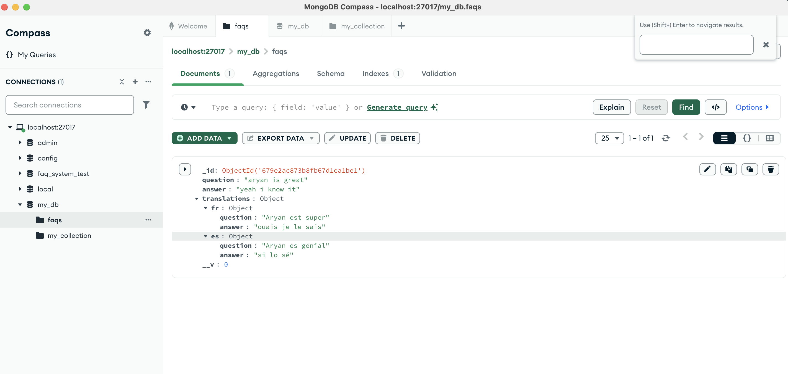

# FAQ Management System

A full-stack FAQ management system with multilingual support, built using the MERN stack (MongoDB, Express.js, React.js, Node.js).

## Tech Stack

### Backend
- Node.js
- Express.js
- MongoDB (Database)
- Redis (Caching)
- Jest (Testing)
- Google Translate API (Translation Service)

### Frontend
- React.js
- Material-UI (MUI)
- React Router
- Axios
- React-Quill (Rich Text Editor)

### DevOps & Tools
- Docker
- Heroku (Deployment)
- Git (Version Control)

## Features

- Create and manage FAQs
- Multi-language support (English, French, Spanish)
- Rich text editing for answers
- Caching system for improved performance
- Responsive design
- Admin panel for content management

## Prerequisites

Before you begin, ensure you have the following installed:
- Node.js (v14 or higher)
- npm (v6 or higher)
- MongoDB
- Redis

## Installation & Setup

1. **Clone the repository**
   ```sh
   git clone https://github.com/your-username/faq-management.git
   cd faq-management
   ```

2. **Install dependencies**
   ```sh
   npm install
   cd client && npm install
   ```

3. **Set up environment variables**
   - Create a `.env` file in the root directory and add:
     ```sh
     MONGO_URI=your_mongodb_connection_string
     REDIS_URL=your_redis_connection_string
     PORT=8000
     ```

4. **Start the server**
   ```sh
   npm start
   ```

5. **Start the client**
   ```sh
   cd client
   npm start
   ```

## API Usage (cURL Examples)

### Create a new FAQ
```sh
curl --request POST \
  --url http://localhost:8000/api/faqs \
  --header 'Content-Type: application/json' \
  --data '{"question": "What is the capital of France?", "answer": "Paris"}'
```

### Get all FAQs
```sh
curl --request GET \
  --url http://localhost:8000/api/faqs 
```

### Translate an FAQ
```sh
curl --request POST \
  --url http://localhost:8000/api/faqs/translate \
  --header 'Content-Type: application/json' \
  --data '{"question": "What is the capital of France?", "to": "fr"}'
```

## Adding Screenshots to README.md

To add screenshots, follow these steps:




  
   ```
3. Commit and push the images to the repository so they are accessible in the README file.

## Contributing

Contributions are welcome! Please open an issue or submit a pull request.

## License

This project is licensed under the MIT License - see the [LICENSE](LICENSE) file for details.

